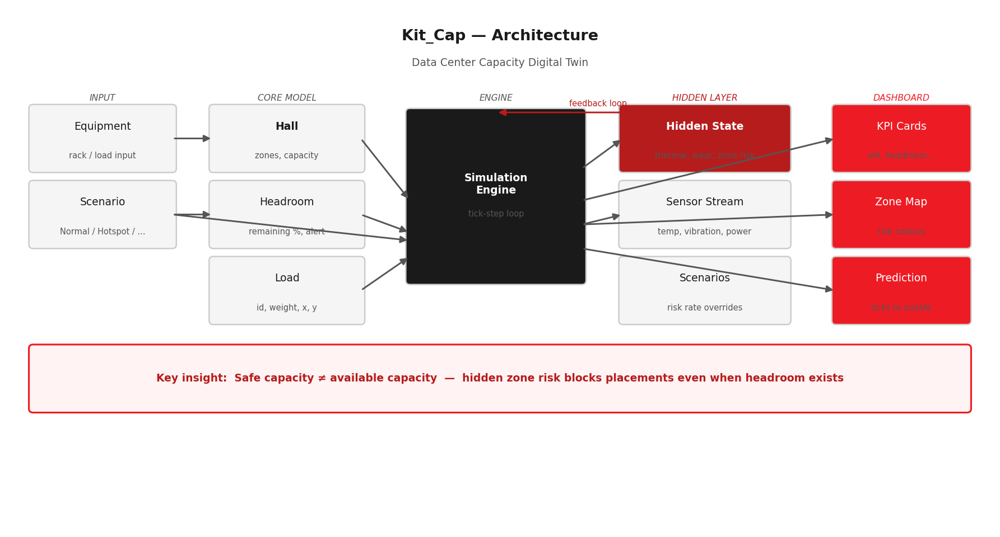

# Kit_Cap
### Data Center Capacity Digital Twin

> **Safe capacity ≠ available capacity.**
> Kit_Cap models the hidden thermal state of a data hall and uses it to block unsafe equipment placements — even when raw headroom says there's room.



---

## What it solves

Data center capacity tools answer *how much space is left*.
Kit_Cap answers *where it is safe to place equipment right now* — by running a live simulation of thermal stress, zone wear, and sensor drift beneath the dashboard.

---

## Live demo

```bash
git clone https://github.com/ankzoutlaw/kit-cap.git
cd kit-cap
pip install -r requirements.txt
streamlit run app.py
```

Open `http://localhost:8501`, pick a scenario, step through the simulation.

---

## How it works

| Layer | What it does |
|-------|-------------|
| **Core model** | Hall with 3 thermal zones, per-rack load placement, capacity headroom |
| **Hidden state** | Per-zone risk accumulates silently each tick based on utilization and zone position |
| **Feedback loop** | When zone risk ≥ 0.7, `can_place()` rejects new equipment regardless of capacity |
| **Prediction** | Linear extrapolation of risk gradient → *"~8 ticks to unsafe state"* |
| **Recommendation** | On rejection, surfaces the safest alternative zone |
| **Sensor stream** | Mock temperature, vibration, power, and cooling readings per tick |
| **Scenarios** | 5 presets (Thermal Hotspot, Cooling Degradation, Load Imbalance, Sensor Drift, Normal) |

---

## Dashboard features

### Step-by-step simulation control
The simulation is fully user-controlled for demo and interview use:
- **Step** — advance exactly 1 tick
- **Run 5** — advance 5 ticks at once
- **Reset** — restart from baseline for the active scenario
- **Auto-run** — toggle continuous advancement (~1 tick/sec), off by default

### Visible vs Hidden state separation
KPIs are split into two labeled groups:
- **Visible State** (blue accent) — Utilization, Headroom, Unsafe Placements Prevented
- **Hidden State** (red accent) — Thermal Stress, Wear, Time to Unsafe

This makes the core thesis immediately scannable: operators see capacity metrics, but the twin infers risk that isn't directly observable.

### Placement Decision Demo
An interactive section to test placement logic in real time:
- Choose equipment ID, weight, and target zone
- **Attempt Placement** — try the selected zone, see accepted/blocked result
- **Redirect to Lowest-Risk Zone** — auto-redirect to the safest available zone
- **Run Placement Story** — one-click scripted demo: attempt stressed zone → blocked → auto-redirect to cool zone → accepted

Each action shows:
- Green/red result card with plain-English reason
- Narrative summary of the reject-then-redirect flow
- Placement event log with tick, zone, risk, and status
- Live recommendation label showing the current safest zone

### Live state mutation
Successful placements immediately update:
- Hall visualization (new rack appears)
- Utilization and headroom KPIs
- Load count and capacity

Thermal stress and zone risk evolve on the next simulation tick using the updated load layout.

### Hall visualization
- Top-down view with color-coded zone risk
- Blocked zones shown with dashed borders and hatching
- Color legend: Low risk / Medium risk / Blocked
- Equipment markers with ID labels

### Sensor trends
Four time-series charts that grow as you step:
- Temperature Trend
- Vibration Trend
- Power Trend
- Cooling Efficiency Trend

---

## Scenarios

| Scenario | Demonstrates |
|----------|-------------|
| Normal | Baseline degradation over time |
| Thermal Hotspot | Zone risk spikes, placement blocked in stressed zone |
| Cooling Degradation | CRAC/CRAH efficiency loss, rising global temperature |
| Load Imbalance | Uneven weight distribution, vibration anomaly |
| Sensor Drift | Temperature reading drifts — model vs sensor divergence |

---

## Interview walkthrough

1. Open the app — starts at tick 0 with equipment placed and baseline metrics
2. Read the callout: *"Safe capacity is not the same as available capacity"*
3. Select **Thermal Hotspot** scenario
4. Click **Step** 10–15 times — watch Stressed Zone risk climb
5. When the zone turns red with hatching: *"The twin just blocked that zone"*
6. Scroll to **Placement Decision Demo** → click **Run Placement Story**
7. Show the narrative: *"System blocked unsafe placement and redirected to Cool Zone"*
8. Point to Visible vs Hidden state split: *"Operators see 79% utilization. The twin sees risk they can't."*
9. Toggle **Auto-run** briefly, then freeze at an interesting moment
10. Switch to a different scenario to show another failure mode

---

## Stack

- **Python 3.10** — zero heavy dependencies in the simulation core
- **Streamlit** — interactive dashboard with scenario controls
- **Matplotlib** — top-down hall map with risk colour gradients
- **Pandas** — event logs and zone risk tables
- **pytest** — 17 unit tests covering model, engine, sensors, scenarios

---

## Key engineering decisions

**Hidden state as a first-class citizen.**
Most capacity tools are stateless — they answer point-in-time queries. Kit_Cap maintains internal state that evolves each tick. This is what makes it a *twin* rather than a dashboard.

**Placement gating via hidden state.**
`Hall.can_place(load, hidden_state)` is the core interface. Passing `hidden_state` is optional — the model degrades gracefully to pure capacity checking without it.

**Separation of concerns.**
`Hall` manages physical constraints. `HiddenState` manages thermal degradation. `Headroom` manages capacity monitoring. `SimulationEngine` composes them. Each is independently testable.

**Live snapshot for immediate feedback.**
`get_current_snapshot()` recomputes KPIs from live hall state without advancing the tick. This means placement mutations are visible immediately, while thermal effects evolve naturally on the next step.

**Predictive output.**
The "Time to Unsafe State" KPI extrapolates the current risk gradient linearly. Simple math, but it shifts the system from reactive monitoring to forward-looking decision support.

---

## Project structure

```
kit_cap/
├── app.py               # Streamlit dashboard
├── main.py              # CLI demo (no dependencies)
├── src/
│   ├── hall.py          # Data hall model + zone logic
│   ├── load.py          # Equipment data class
│   └── headroom.py      # Capacity headroom calculator
├── sim/
│   ├── engine.py        # Time-step simulation engine
│   ├── hidden.py        # Hidden state (thermal, wear, zone risk)
│   ├── sensors.py       # Mock sensor stream
│   └── scenarios.py     # Scenario configuration
├── tests/               # 17 pytest unit tests
├── architecture.png     # System architecture diagram
└── requirements.txt
```

---

## Tests

```bash
python -m pytest tests/ -v
# 17 passed
```

---

*Built by Ankit Tripathi — contact.ankit.tripathi@gmail.com*
